````md
# Personal Portfolio Website

## Project Overview
This project is a personal portfolio website created to showcase my background, education, skills, projects, and contact information. It is built using HTML, CSS, and a small amount of JavaScript. The goal of this project is to present my work, experience, and interests in a clear, organized, and professional way.

This website was developed as a class project and includes multiple pages, responsive styling, and simple JavaScript features. It is designed to be easy to navigate and readable on different screen sizes.

---

## Features
- Home / About Me page
- Education page
- Skills page
- Projects page
- Contact page
- Responsive layout
- Navigation bar across all pages
- Basic JavaScript interaction
- Simple contact form validation

---

## Technologies Used
- HTML
- CSS
- JavaScript

---

## Project Structure
```text
Personal Portfolio Website/
│── index.html
│── education.html
│── skills.html
│── projects.html
│── contact.html
│── style.css
│── script.js
│── README.md
│── images/
│── projects/
│── screenshots/
````

---

## Pages Included

### Home / About Me

The home page introduces who I am, my academic background, interests, goals, and a short summary about my experience. It also includes a profile image and a button with a simple JavaScript interaction.

**Screenshot:** `Takeo_Project1_DesktopSS_HomePage.png`

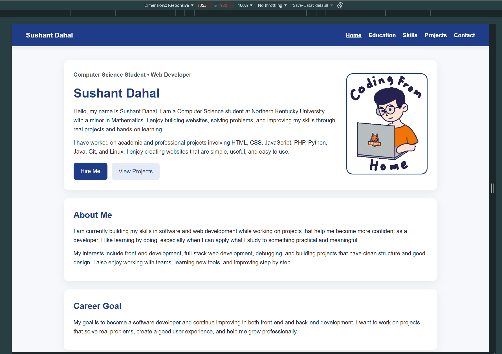

### Education

This page includes my university information, degree details, expected graduation date, and relevant coursework.

**Screenshot:** `Takeo_Project1_DesktopSS_EducationPage.png`

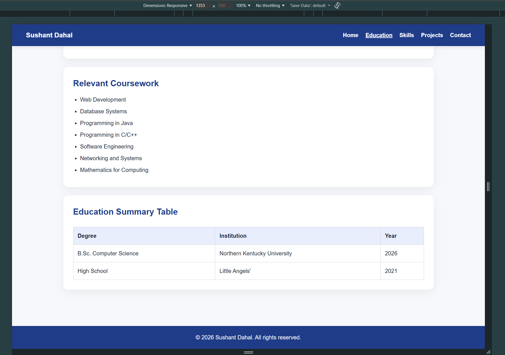

### Skills

This page highlights my technical and professional skills in organized sections such as programming languages, web development, tools, and other strengths.

**Screenshot:** `Takeo_Project1_DesktopSS_SkillsPage.png`

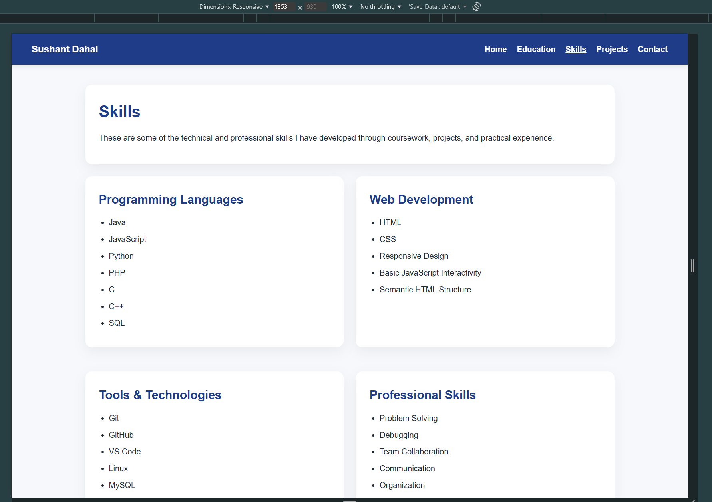

### Projects

This page shows some of the projects I have worked on and includes a short description of each one, along with the tools used and what I learned from them.

**Screenshot:** `Takeo_Project1_DesktopSS_ProjectsPage.png`

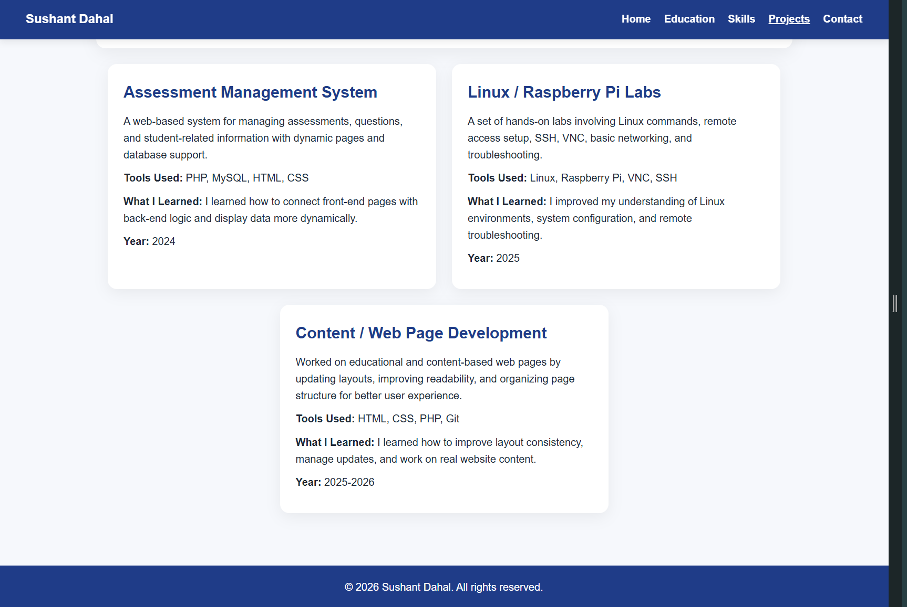

### Contact

This page includes my email, phone number, GitHub, LinkedIn, and a simple contact form for user input.

**Screenshot:** `Takeo_Project1_DesktopSS_ContactPage.png`

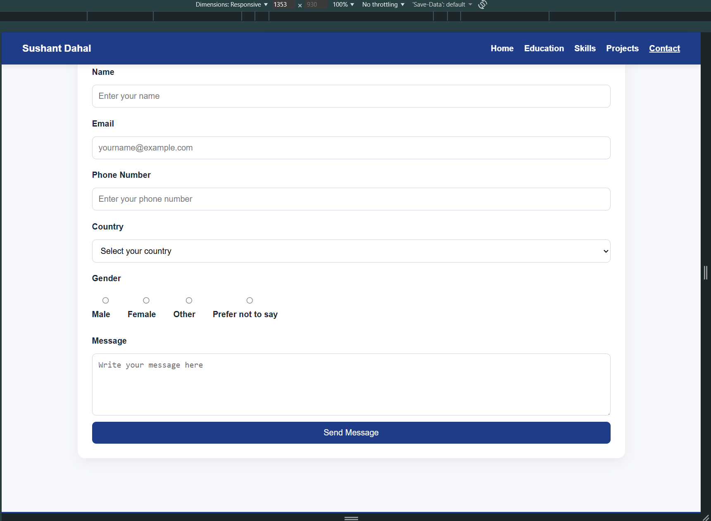

---

## JavaScript Features

This project includes very basic JavaScript features:

* A **Hire Me** button that displays an alert when clicked
* A simple contact form validation that checks whether the name and email fields are empty before submission

These features were kept simple to match my current level of JavaScript knowledge.

### Hire Me Button Alert

**Screenshot:** `Takeo_Project1_DesktopSS_HireMe.png`

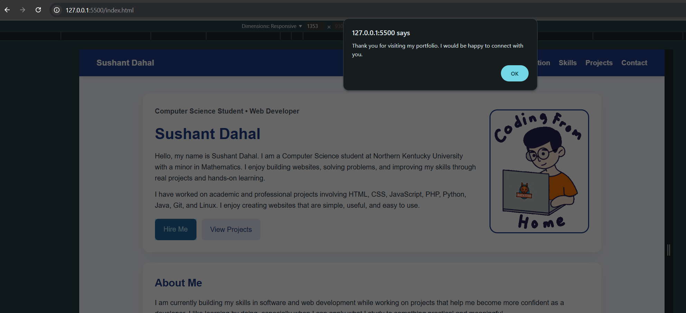

### Contact Form Validation

**Screenshot:** `Takeo_Project1_MobileSS_ContactPage_Validation1.png`

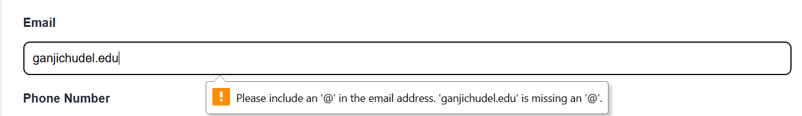

---

## Responsive Design

The website uses responsive CSS styling so that it can adjust better on different screen sizes such as desktop, tablet, and mobile. Basic media queries were used to improve layout, spacing, and readability on smaller devices.

### Mobile Home View

**Screenshot:** `Takeo_Project1_MobileSS_HomePage.png`

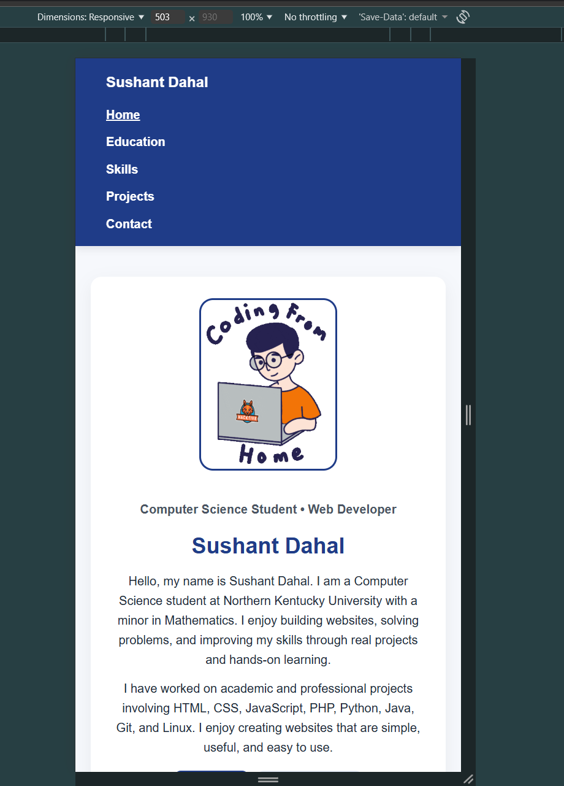

### Mobile Education View

**Screenshot:** `Takeo_Project1_MobileSS_EducationPage.png`

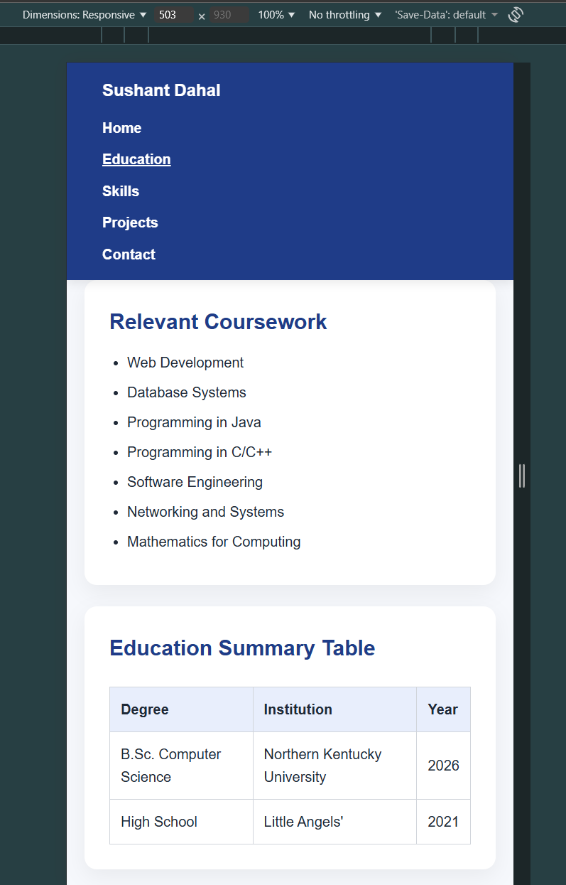

### Mobile Skills View

**Screenshot:** `Takeo_Project1_MobileSS_SkillsPage.png`

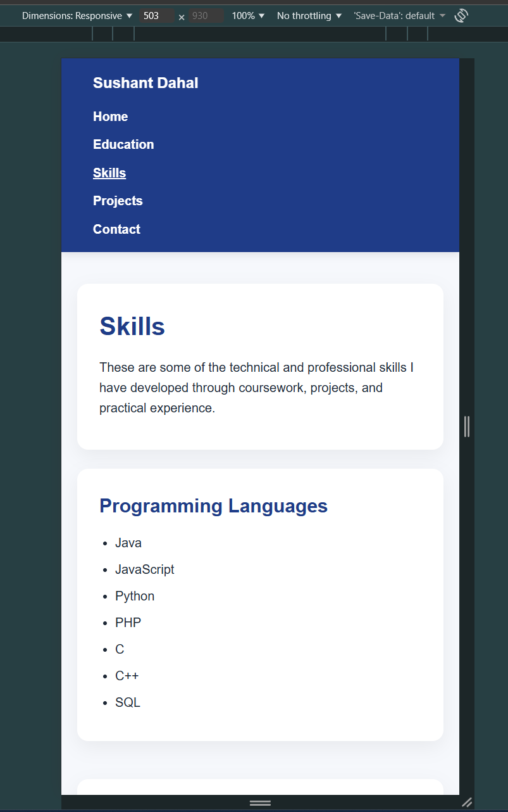

### Mobile Projects View

**Screenshot:** `Takeo_Project1_MobileSS_ProjectsPage.png`

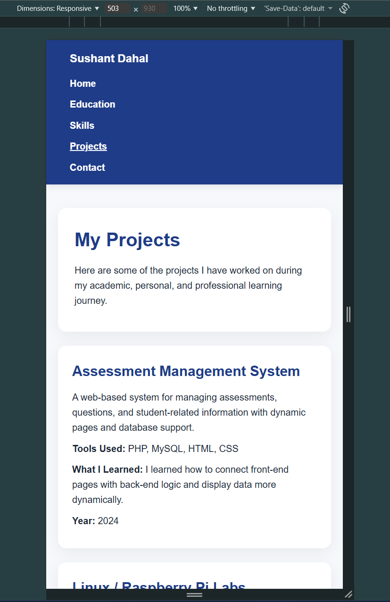

### Mobile Contact View

**Screenshot:** `Takeo_Project1_MobileSS_ContactPage.png`

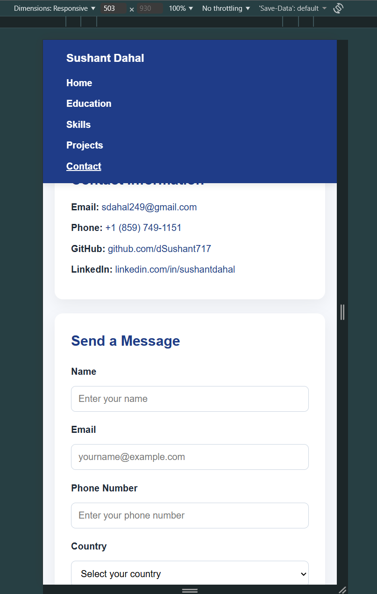

---

## Setup Instructions

1. Download or clone the repository
2. Open the project folder
3. Open `index.html` in your browser

---

## What I Learned

Through this project, I practiced:

* structuring a multi-page website using HTML
* styling pages with CSS
* making layouts more responsive
* organizing content clearly
* adding simple JavaScript interactivity
* improving consistency across different pages

This project also helped me understand how to build a more complete website from planning to final submission.

---

## Author

Sushant Dahal

---

## GitHub Repository Link

[Personal Portfolio Website](https://github.com/dSushant717/Personal-Portfolio)

```
```
